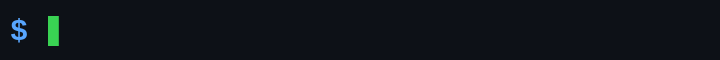

  

<h3><code>izza@github ~ $ ./contributions.sh</code></h3>
<!-- Snake lives on the `output` branch, generated by .github/workflows/snake.yml.
     It appears after that workflow runs once (Actions tab -> Generate snake animation). -->
<picture>
  <source media="(prefers-color-scheme: dark)" srcset="https://raw.githubusercontent.com/Izza-niazi/Izza-niazi/output/github-snake-dark.svg" />
  <source media="(prefers-color-scheme: light)" srcset="https://raw.githubusercontent.com/Izza-niazi/Izza-niazi/output/github-snake.svg" />
  
</picture>

  

<h3><code>izza@github ~ $ whoami</code></h3>
<table>
  <tr>
    <td valign="top"></td>
    <td valign="top"></td>
  </tr>
</table>

 

<h3><code>izza@github ~ $ ./streak.sh</code></h3>

  

<h3><code>izza@github ~ $ cat stack.txt</code></h3>

  

<h3><code>izza@github ~ $ ./arcade.sh</code></h3>

 

<!-- Interactive: click a cartridge to load it. GitHub renders 
 natively (no JS). -->

🕹️ &nbsp;<b>▸ PROJECTS</b>&nbsp; — press to load

 

<ul>
<li>📱 <b>Quantum Edge Mobile</b> — cross-platform mobile app (React Native · Expo)</li>
<li>🩺 <b>Telemedicine</b> — healthcare app for patient–doctor consults</li>
<li>🦈 <b>SharkStack Website</b> — website build</li>
<li>☕ <b>BeanMachine</b> — full-stack project</li>
</ul>

🏆 &nbsp;<b>▸ HIGH SCORES</b>&nbsp; — achievements

 

<ul>
<li>🧑‍💻 YOLO &nbsp;·&nbsp; 🚀 Quickdraw &nbsp;·&nbsp; 🦈 Pull Shark ×3</li>
<li>🛠️ Full-stack builder — mobile and web</li>
</ul>

💾 &nbsp;<b>▸ SECRET</b>&nbsp; — insert coin

 

Currently building <b>AI-powered apps</b>. Ask me about React Native, LLM tooling,
or clean architecture. ☕

 

<h3><code>izza@github ~ $ ./connect.sh</code></h3>

<!--
  Regeneration cheat-sheet
  ------------------------
  Static (rerun when your photo / details change):
    python scripts/prep_photo.py source-photo.jpg && python scripts/make_ascii_svg.py
    python scripts/make_info_card.py
    python scripts/make_typing_svg.py          # edit PHRASES in the script first
    python scripts/make_stack_svg.py           # edit TECHS in the script first
    python scripts/make_pixel_svg.py           # retro pixel-art arcade banner

  Daily automation (.github/workflows/update-profile-art.yml):
    python scripts/fetch_contributions.py      # scrape public calendar, no token
    python scripts/render_streak_svg.py        # -> streak-stats.svg

  The contribution graph itself is the snake (.github/workflows/snake.yml),
  which commits SVGs to the `output` branch twice a day.
  (render_heatmap_svg.py is kept but unused — run it if you want the static grid back.)

  GitHub markdown gotchas: inline style="" is stripped (use   for spacing);
  <h1>/<h2> draw a full-width rule (use <h3>); no JS, no external CSS — all
  animation lives inside each self-hosted SVG.
-->
